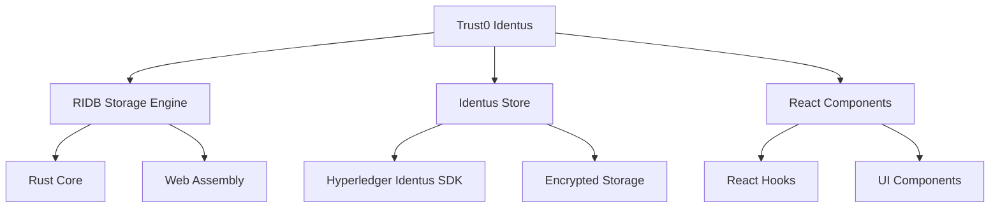

<p align="center">
  
  <br />
</p>

# 🚀 Identus
**Next-generation tooling for [Hyperledger Identus SDK](https://github.com/hyperledger-identus/sdk-ts)** - Bridging the gap between decentralized identity and production-ready applications.

## 🌟 Overview

Trust0 Identus provides a comprehensive suite of packages designed to streamline integration with Hyperledger Identus SDK. After years of collaboration with the Identus community, we've identified and solved critical gaps in storage solutions, React integrations, and developer experience.

### 🎯 Key Challenges Addressed

- **Secure Storage**: Enterprise-grade encrypted storage solutions
- **Developer Experience**: Simplified APIs and React components
- **Performance**: Lightweight, rust-powered database engine
- **Cross-Platform**: Seamless browser and Node.js compatibility

## 🏗️ Architecture



## 📦 Packages

### 🗄️ RIDB - Next-Gen Storage Engine
Our flagship rust-powered database wrapper designed for modern web and Node.js applications.

**Features:**
- 🔒 **Security-First**: Built-in encryption and secure key management
- ⚡ **High Performance**: Rust core with WebAssembly bindings
- 🪶 **Lightweight**: Minimal footprint, maximum performance
- 🌍 **Cross-Platform**: Browser, Node.js, and mobile ready

[📖 Learn more about RIDB](https://trust0.id/ridb) | [🔗 Repository](https://github.com/trust0-project/RIDB)

### 🏪 Identus Store
Production-ready storage wrapper built on RIDB, specifically designed for Hyperledger Identus SDK.

**Key Benefits:**
- 🔄 **Drop-in Replacement**: Seamless migration from existing storage solutions
- 🛡️ **Enterprise Security**: Advanced encryption and access controls
- 📊 **Performance Monitoring**: Built-in metrics and debugging tools

[📖 Documentation](./docs/@trust0/identus-store/README.md)

### ⚛️ React Components
A comprehensive set of React components and hooks for rapid Identus integration.

**Planned Features:**
- 🎨 **Pre-built UI Components**: Wallet management, credential display, QR codes
- 🪝 **Custom Hooks**: State management, storage, and SDK interactions
- 📱 **Responsive Design**: Mobile-first approach with modern styling

[📖 Documentation](./docs/@trust0/identus-react/README.md)

## 🚀 Quick Start

```bash
# Install the core package
npm install @trust0/identus-store

# For React integration
npm install @trust0/identus-react 
```

### Basic Usage

```typescript
import { StorageTypes } from '@trust0/ridb';
import { createStore } from '@trust0/identus-store';
import { Agent } from '@hyperledger/identus-sdk';

const db = new RIDB({schemas})
// Initialize with RIDB storage
const store = createStore({
  db,
  storageType: StorageTypes.IndexDB
});

// Create Identus agent with secure storage
const agent = SDK.Agent.initialize({
  pluto: store.pluto,
  // ... other configurations
});
```

### For react usage

Please go [here](./docs/@trust0/identus-react/README.md)

## 🤝 Contributing

We welcome contributions from the community! Here's how to get started:

1. **Fork** the repository
2. **Create** a feature branch: `git checkout -b feature/amazing-feature`
3. **Commit** your changes: `git commit -m 'Add amazing feature'`
4. **Push** to the branch: `git push origin feature/amazing-feature`
5. **Open** a Pull Request

### Development Setup

```bash
# Clone the repository
git clone https://github.com/trust0-project/identus.git && cd identus

# Install dependencies
npm install

# Run tests
npm test

# Start development server
npm run dev
```

## 📚 Resources

- 🌐 **Website**: [trust0.id](https://trust0.id)
- 🐛 **Issues**: [GitHub Issues](https://github.com/trust0-project/identus/issues)

## 📄 License

This project is licensed under the Apache License 2.0 - see the [LICENSE](LICENSE) file for details.

## 🙏 Acknowledgments

- **Hyperledger Identus Community** - For their continued collaboration and innovation
- **Contributors** - Thank you to all the developers who have contributed to this project
- **Open Source Community** - For the tools and libraries that make this work possible

---

<div align="center">

**Built with ❤️ by the Trust0 Team**

[Website](https://trust0.id) • [Twitter](https://twitter.com/elribonazo)

</div>
